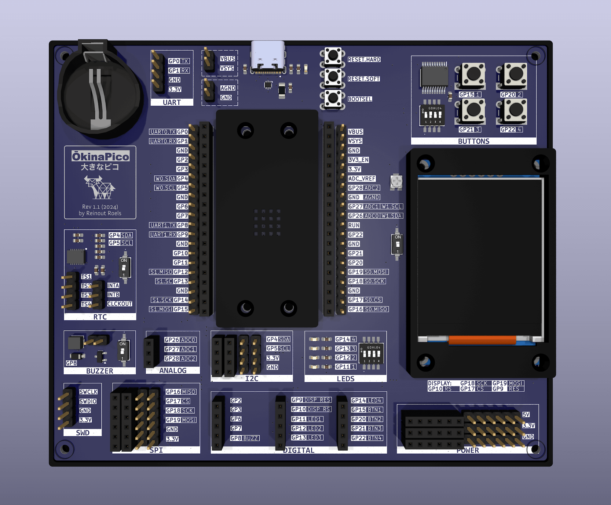

# ŌkinaPico

> [!WARNING]
> The information and material (code, designs, files, ...) are provided "AS IS". We make no representation or warranty of any kind, express or implied, regarding the accuracy, adequacy, validity, reliability, availability, or completeness of any information or material. Use this at your own risk.


The ŌkinaPico is an expansion board for the Raspberry Pi Pico and Pico 2. It was created to help deal with some of the frustrations that we encounter frequently during software development for embedded systems (e.g. Arduino). 

While developing software for embedded systems, we quickly ran into some shortcomings of existing development boards, such as cripling hardware limitation or a lack of usability in general. 

While there are some more "heavy-weight" boards like the [Arduino Due](https://store.arduino.cc/products/arduino-due), [Arduino Mega](https://store.arduino.cc/collections/boards-modules/products/arduino-mega-2560-rev3) or [Arduino Giga](https://store.arduino.cc/collections/boards-modules/products/giga-r1-wifi), they also have some caveats. For us, the most important one being that their microcontrollers are so different from the basic Arduino models, that a significant amount of Arduino libraries are not supported, or that the Arduino Core for these boards does not implement some relatively basic features (e.g. PWM, tone, interrupts, ...). 

We selected the RP2350 microcontroller as the main driver for the ŌkinaPico. However, in order to not reinvent the wheel, we designed the ŌkinaPico as an expansion board for the cheap and readily available [Raspberry Pi Pico 2](https://www.raspberrypi.com/products/raspberry-pi-pico-2/) board. As the hardware footprint is backwards compatible, the ŌkinaPico also supports the original RP2040-based [Raspberry Pi Pico 1](https://www.raspberrypi.com/products/raspberry-pi-pico/). 

**The main use case of the ŌkinaPico is to develop software (e.g. hardware drivers, or Arduino libraries) for other hardware. For this reason, the ŌkinaPico deliberately sacrifices compactness in favour of various quality-of-life enhancements.**



# Features

## Quality-of-Life Enhancements

* DIP switches for toggling peripherals
    * disable peripherals at the hardware level, in order to reuse the associate microcontroller pins elsewhere 
* USB-C connector (power + data)
* Hardware reset buttons
* User-friendly layout and labelling 
	* reduce the need to constantly pull up pinout documentation
* Choice of male and female connectors
	*  make it easier to connect external modules

## Extra On-Board Peripherals

* 🖥️ Display
    * 1.77 inch SPI TFT Display (128x160 pixels)
        * ST7735 controller, adjustable backlight, 18-bit colour
* 👇 Buttons
    * 4 user-programmable buttons
    * hardware debouncing ([Analog Devices MAX6818](https://www.analog.com/en/products/max6818.html))
* 🎵 Buzzer 
    * 65 dB magnetic audio transducer buzzer ([CUI CMT-322-65-SMT-TR](https://www.sameskydevices.com/product/audio/buzzers/audio-transducers/cmt-322-65-smt-tr))

* 🕙 Real Time Clock
    * nano-power highly accurate RTC ([NXP PCF2131](https://www.nxp.com/products/PCF2131))
    * battery backup, configurable square wave output (1Hz - 32.768Khz), interrupts, ...
* ⚡ ESD protection + Current Fuse 
    * protect the hardware against permanent damage 
* 💡 LEDs
    * 4 user-programmable LEDs
    * 1 x red, 1 x blue, 1 x green, 1 x white 
    
## Software Support

* As it's essentially a Rasperry Pi Pico (2) with extra peripherals, you can make use of the plethora of existing guide, tutorials and examples for the Pico (2) 
* Runs Arduino, with excellent support for the Pico's hardware features 
	* [https://github.com/earlephilhower/arduino-pico](https://github.com/earlephilhower/arduino-pico) 


# Hardware Revisions

## Rev. 1.1. (November 2024)

* added potentiometer for adjusting display backlight brightness
* LEDs now turn on by sourcing current, instead of sinking current
	* otherwise LEDs are on by default, due to the RP2350 default pin state 
* decoupled reset and bootsel buttons from the debouncer IC
* aesthetic changes (fonts, layout, pcb art, ...)
* minor hardware optimisations 

## Rev. 1.0. (September 2024)

* initial release

# DIY Assembly Guide

# Code Examples

## Setup

To setup your Raspberry Pi Pico (2) for Arduino development, follow the excellent instructions here:

[https://github.com/earlephilhower/arduino-pico](https://github.com/earlephilhower/arduino-pico)

The ŌkinaPico can also be used with [arduino-cli](https://github.com/arduino/arduino-cli) or [PlatformIO](https://platformio.org/). We refer to their documentation for more details (simply look for instructions for the Raspberry Pi Pico (2)).

## Example: Buttons

The button pins are "LOW" when the button is pressed, and "HIGH" otherwise. Make sure to activate the internal pull-ups for these pins!

<details>
<summary>Example</summary>

```C++
#define BUTTON_1 15
#define BUTTON_2 20
#define BUTTON_3 21
#define BUTTON_4 22
	
void setup() {
  Serial.begin(9600);
  pinMode(BUTTON_1, INPUT_PULLUP); 
  pinMode(BUTTON_2, INPUT_PULLUP); 
  pinMode(BUTTON_3, INPUT_PULLUP); 
  pinMode(BUTTON_4, INPUT_PULLUP); 
}
	
void loop() {
  if(digitalRead(BUTTON_1) == LOW){ Serial.println("button 1"); }
  if(digitalRead(BUTTON_2) == LOW){ Serial.println("button 2"); }
  if(digitalRead(BUTTON_3) == LOW){ Serial.println("button 3"); }
  if(digitalRead(BUTTON_4) == LOW){ Serial.println("button 4"); }
  delay(100);
}
```
</details>

## Example: LEDs

Set the corresponding LED pin "HIGH" to turn on the LED.

<details>
<summary>Example</summary>
	
```C++
#define LED_1 11
#define LED_2 12
#define LED_3 13
#define LED_4 14
	
void setup() {
  Serial.begin(9600);
  pinMode(LED_1, OUTPUT); 
  pinMode(LED_2, OUTPUT); 
  pinMode(LED_3, OUTPUT); 
  pinMode(LED_4, OUTPUT); 
  digitalWrite(LED_1, HIGH);  
  digitalWrite(LED_2, HIGH);  
  digitalWrite(LED_3, HIGH);  
  digitalWrite(LED_4, HIGH);  
}
	
void loop() {
  delay(1000);
}
```
</details>


## Example: Display

Requires the "[Adafruit ST7735 Library](https://github.com/adafruit/Adafruit-ST7735-Library)". Can be installed via Arduino IDE, arduino-cli or PlatformIO. 

<details>
<summary>Example</summary>
	
```C++
#include <Adafruit_GFX.h>
#include <Adafruit_ST7735.h> 
#include <SPI.h>
	
#define TFT_CS     17
#define TFT_RST    9 
#define TFT_DC     10
Adafruit_ST7735 tft = Adafruit_ST7735(TFT_CS, TFT_DC, TFT_RST);
	
void setup() {
  tft.setSPISpeed(32000000);
  tft.initR(INITR_BLACKTAB); 
  tft.fillScreen(ST77XX_BLACK);
}
	
void loop() {
  tft.setTextSize(2);
  tft.setCursor(0, 0);
  tft.setTextColor(ST77XX_WHITE, ST77XX_BLACK);
  tft.setTextWrap(true);
  tft.print("HELLO WORLD");
  
  delay(1000);
}
```
</details>


## Example: RTC

Requires the "[RTC\_NXP\_Arduino](https://github.com/teddokano/RTC_NXP_Arduino)" library. Can be installed via Arduino IDE, arduino-cli or PlatformIO. 

<details>
<summary>Example</summary>
	
```C++
#include <PCF2131_I2C.h>
#include <time.h>
	
PCF2131_I2C rtc;
	
void setup() {
  Serial.begin(9600);
  Wire.begin();
 
  set_time();
}
	
void loop() {
  time_t current_time = rtc.time(NULL);
  Serial.print("time : ");
  Serial.print(current_time);
  Serial.print(", ");
  Serial.println(ctime(&current_time));
	
  delay(1000);
}
	
	
void set_time()
{
    char s_month[5];
    int year;
    tm t{};
    static constexpr char month_names[37] = "JanFebMarAprMayJunJulAugSepOctNovDec";
	
    // extract time values from strings
    sscanf(__DATE__, "%s %d %d", s_month, &t.tm_mday, &year);
    sscanf(__TIME__, "%2d %*c %2d %*c %2d", &t.tm_hour, &t.tm_min, &t.tm_sec);
	
    // find where is s_month in month_names. Deduce month value.
    t.tm_mon = (strstr(month_names, s_month) - month_names) / 3;
    t.tm_year = year - 1900;
	
    // add 30 seconds to compensate for compile/upload time
    time_t timestamp = mktime(&t);
    timestamp = timestamp + 30;
    localtime_r(&timestamp, &t);
	
    rtc.set(&t);
}
```
</details>


<details>
<summary>Example 2: battery backup</summary>

```C++
#include <PCF2131_I2C.h>
#include <time.h>


class PCF2131 : public PCF2131_I2C
{
public:
  void enable_battery_failover();
  void clear_stop_flag();
};

PCF2131 rtc;

void setup() {

  Serial.begin(9600);

  Wire.begin();
  
  if (rtc.oscillator_stop()) {
    Serial.println("==== oscillator_stop detected :( ====");
    rtc.clear_stop_flag();
    set_time();
  } else {
    Serial.println("---- RTC has beeing kept running! :) ----");
  }

  rtc.enable_battery_failover();
}

void loop() {
  time_t current_time = rtc.time(NULL);
  Serial.print("time : ");
  Serial.print(current_time);
  Serial.print(", ");
  Serial.println(ctime(&current_time));

  delay(1000);
}


void PCF2131::enable_battery_failover()
{
  bit_op8(0x02, 0b00011111, 0b00000000);
}

void PCF2131::clear_stop_flag()
{
  bit_op8(0x07, 0b01111111, 0b00000000);
}


void set_time()
{
    char s_month[5];
    int year;
    tm t{};
    static constexpr char month_names[37] = "JanFebMarAprMayJunJulAugSepOctNovDec";

    // extract time values from strings
    sscanf(__DATE__, "%s %d %d", s_month, &t.tm_mday, &year);
    sscanf(__TIME__, "%2d %*c %2d %*c %2d", &t.tm_hour, &t.tm_min, &t.tm_sec);

    // find where is s_month in month_names. Deduce month value.
    t.tm_mon = (strstr(month_names, s_month) - month_names) / 3;
    t.tm_year = year - 1900;

    // add 30 seconds to compensate for compile/upload time
    time_t timestamp = mktime(&t);
    timestamp = timestamp + 30;
    localtime_r(&timestamp, &t);

    rtc.set(&t);
}
```
</details>

## Example: Buzzer 

See [this example](https://docs.arduino.cc/built-in-examples/digital/toneMelody/) for a complete list of frequencies. 

<details>
<summary>Example</summary>

```C++
#define BUZZER 8
	
uint8_t freq_index = 0;
uint8_t freq_count = 4;
int freqs[4] = {247, 262, 294, 330};
	
	
void setup() {
  Serial.begin(9600);
  pinMode(BUZZER, OUTPUT); 
}
	
void loop() {
	
  tone(BUZZER, freqs[freq_index], 500);
  delay(500);
	
  if(++freq_index == freq_count){freq_index = 0;}
}
```
</details>


# Future Work

* Dedicated Power Regulator
	* Currently, power is converted to 3.3V by the Pico, with some limitations. It might be useful to have a voltage regulator outside of the Pico, in order to provide a cleaner and higher current supply of power.	

# FAQ


* What does ŌkinaPico mean?
	* The Raspberry Pi Pico (2) was designed to be small and compact (hence "pico"). We expanded it and made it huge again. In Japanese, "ookii" means large. ŌkinaPico losely translates to "huge small thing", and highlights the irony of deliberately increasing the size of the small and compact Pico.
* What's with the yak logo?
	* The need for the ŌkinaPico came out of the software development for other projects, so it was a textbook case of [yak shaving](https://en.wiktionary.org/wiki/yak_shaving).
* Why is the Pico covered with a plastic shield?
	* Purely for aesthetic reasons. As the Pico is only available with a bright green PCB, it sticks out like a sore thumb on the ŌkinaPico. The cover helps it to blend into the general design of the ŌkinaPico. For similar reasons, the display also has a small plastic enclosure.
